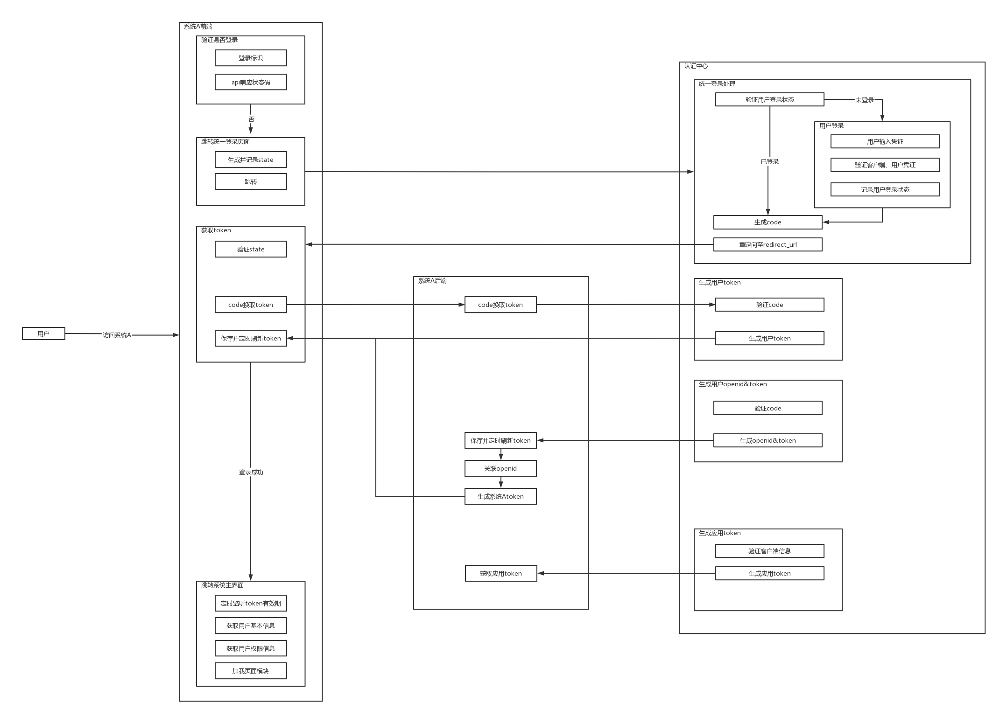
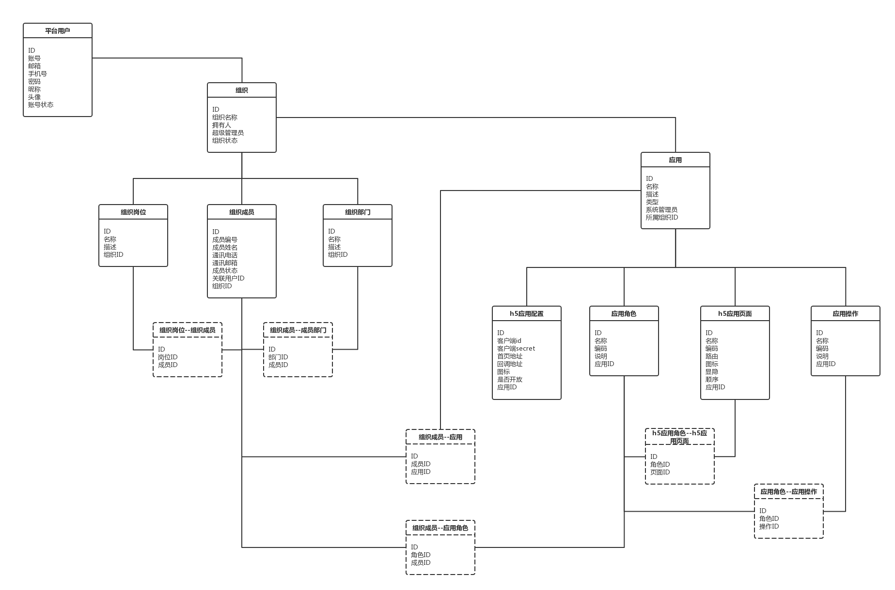

### 快速开始
- #### docker运行
  - 执行`mvn clean package`
  - 执行`docker-compose up -d`
  - 浏览器访问`http://localhost/home`
  - 浏览器访问`http://localhost/bff-demo/demo?param=123`

- #### 后端demo运行

  - 执行`docker-compose up -d zookeeper`
  - 配置host `127.0.0.1  zookeeper`
  - 运行`JsyCloudBffDemoApplication`
  - 运行`JsyCloudProviderDemoApplication`
  - 浏览器访问`http://localhost/bff-demo/demo?param=123`

### 技术架构图

### 认证基本流程

### 系统应用创建初始化流程

### upms模型设计

